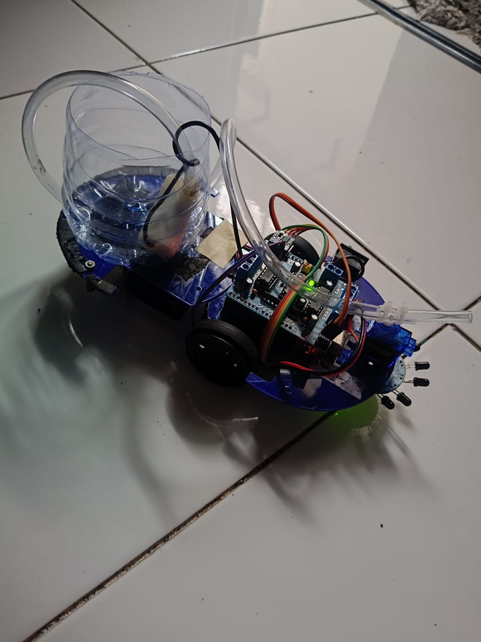
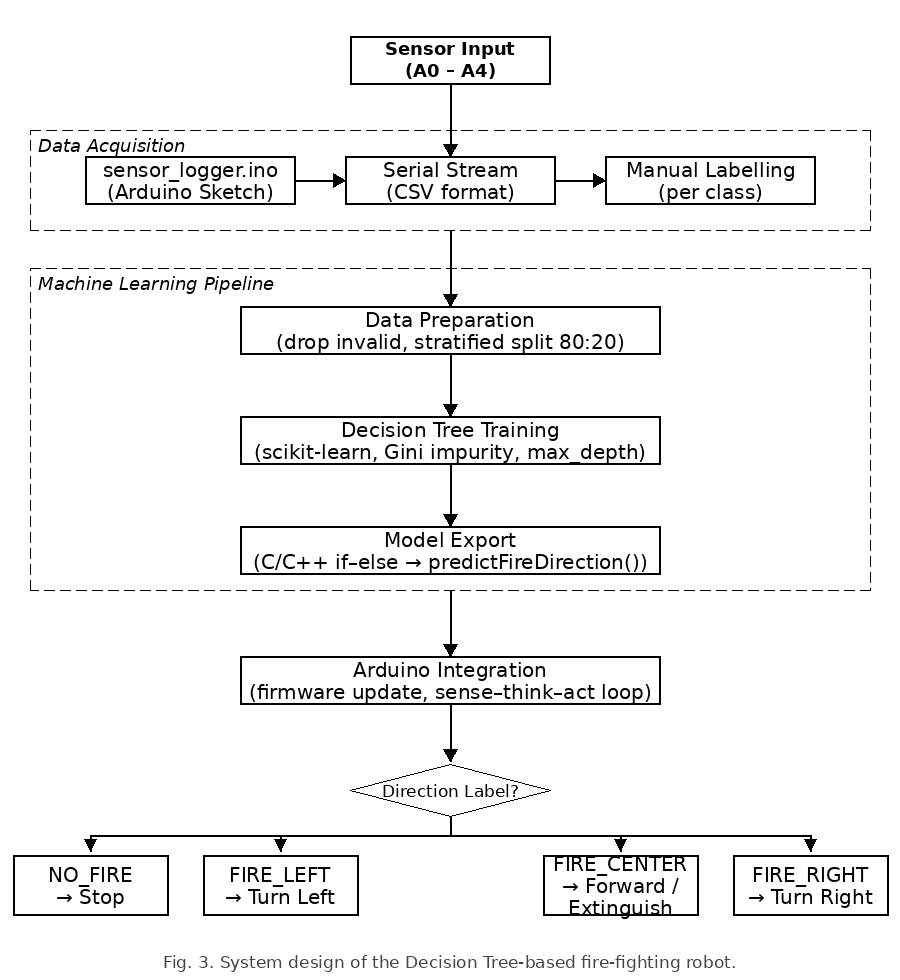
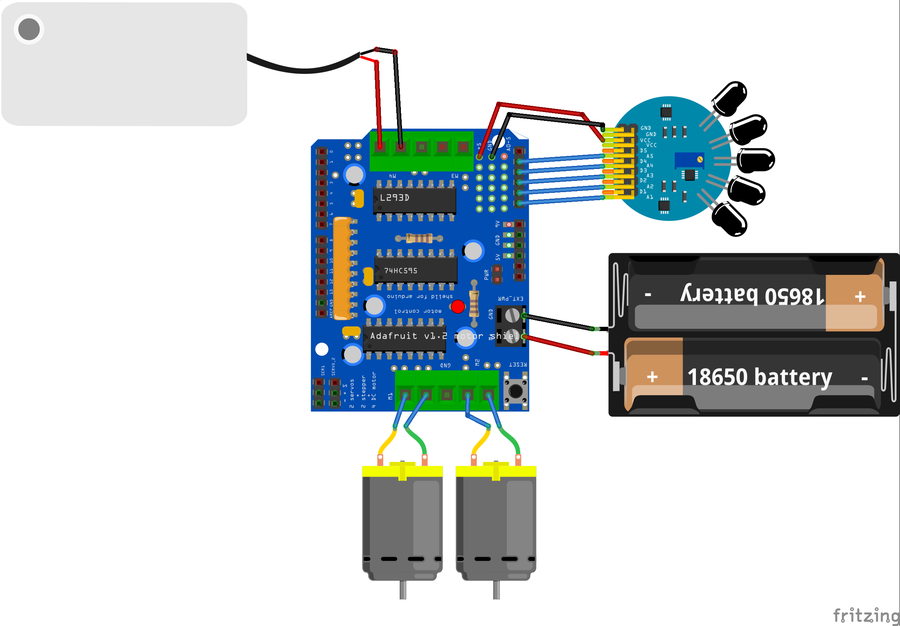

### Fire Fighter Robot ML

A fire fighting robot that uses a Decision Tree on real flame sensor data to figure out where the fire is and point its nozzle at it. The original robot could already move toward fire, but it decided with manual thresholds and the nozzle just swept back and forth. This version learns the fire direction from the sensors instead. Built as the final project for a robotics course.



#### How it works

Model input is a 5 channel flame sensor on the Arduino:

| Arduino | Dataset |
|---|---|
| A5 | `s1` |
| A4 | `s2` |
| A3 | `s3` |
| A2 | `s4` |
| A1 | `s5` |

Output is a 4 class label:

| Label | Robot action |
|---|---|
| `NO_FIRE` | stop, pump off, servo centered |
| `FIRE_LEFT` | turn left, nozzle left |
| `FIRE_CENTER` | move forward, nozzle centered |
| `FIRE_RIGHT` | turn right, nozzle right |

Proximity (fire very close) stays as a deterministic threshold on the center channel (A3/s3), separate from the model. If the prediction is `FIRE_CENTER` and `s3 <= PROXIMITY_THRESHOLD`, the robot stops and sprays.



#### Hardware

Arduino with an Adafruit Motor Shield (L293D), a 5 channel flame sensor, two DC motors, a small water pump, and 18650 batteries.



#### Data

Real flame sensor data collected from the robot: 260 samples across the 4 classes (NO_FIRE 85, FIRE_CENTER 74, FIRE_RIGHT 59, FIRE_LEFT 42), then interpolated, smoothed and cleaned. It lives in `data/dataset_fire_robot_interpolated_smoothed_clean.csv`. There's also a tiny dummy set just for quick pipeline sanity checks.

#### Methodology

The training notebook follows the data science flow from class:

1. Business Understanding
2. Analytic Approach
3. Data Requirement and Data Collection
4. Data Understanding
5. Data Preparation
6. Feature Engineering
7. Modeling Scenario
8. Evaluation
9. Model Interpretation
10. Deployment to Arduino

Algorithm: Decision Tree Classifier. It's light, easy to explain, and the result exports to plain if-else code for the Arduino with no extra ML library.

#### Run

```bash
python -m venv .venv
source .venv/bin/activate        # on Windows: .\.venv\Scripts\Activate.ps1
pip install -r requirements.txt

python ml/train_fire_model.py data/dataset_fire_robot_interpolated_smoothed_clean.csv
```

Training prints an Arduino function you can paste straight into the robot code:

```cpp
int predictFireDirection(int s1, int s2, int s3, int s4, int s5) {
  // Decision Tree rules from training
}
```

There's also `ml/train_fire_model.ipynb` if you'd rather read through the steps.

#### How the data was collected

1. Upload `arduino/01_sensor_logger/01_sensor_logger.ino` to the robot.
2. Open Serial Monitor at 9600 baud, you'll see the header `s1,s2,s3,s4,s5`.
3. Record per fire position: no fire to `NO_FIRE`, fire front-left (A5/A4) to `FIRE_LEFT`, front-center (A3) to `FIRE_CENTER`, front-right (A2/A1) to `FIRE_RIGHT`.
4. Add a `label` column, then clean and smooth the readings.
5. Train, copy the generated `predictFireDirection()` into `arduino/02_fire_robot_ml/02_fire_robot_ml.ino`, and tune `PROXIMITY_THRESHOLD` from the center sensor when the fire is very close.

#### Status

Done:
- Robot built and wired (see photo above)
- Real dataset collected, 260 samples across 4 classes
- Training notebook and script, Decision Tree exported to Arduino if-else
- Sensor logger and final robot firmware with the sense-think-act loop


